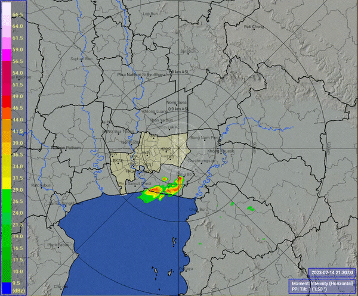

# weather



## Commands

png to mp4

```sh
ffmpeg -framerate 30 -pattern_type glob -i 'radar_frame_timestamp_*.png' -c:v libx264 -pix_fmt yuv420p -vf "pad=ceil(iw/2)*2:ih" output.mp4

export fv_date=2023-07-30
ffmpeg -framerate 30 -pattern_type glob -i "radar_frame_timestamp_${fv_date}*.png" -c:v libx264 -pix_fmt yuv420p -vf "pad=ceil(iw/2)*2:ih" ${fv_date}.mp4
```